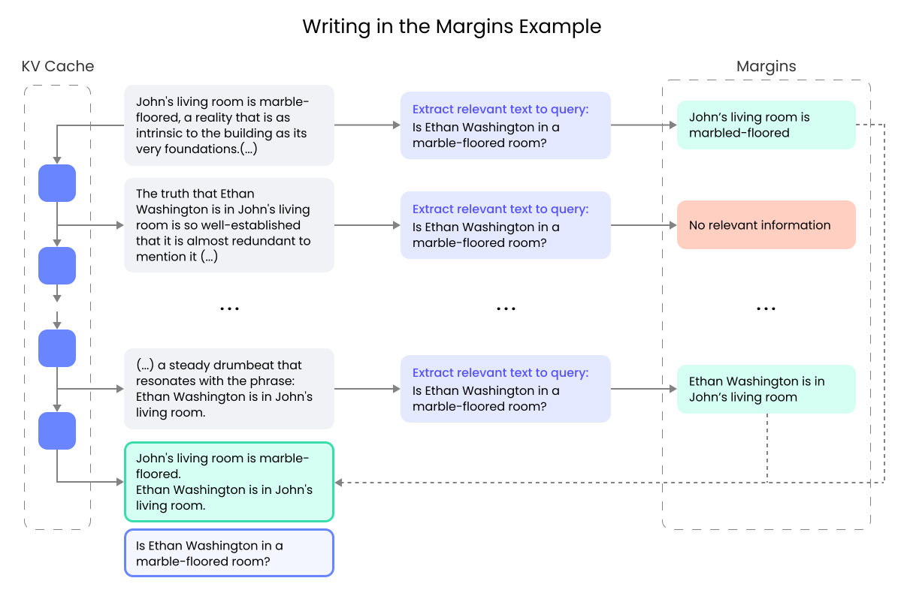

# Writing in the Margins

<p align="center">
    
</p>

## Paper

[Writing in the Margins: Better Inference Pattern for Long Context Retrieval](https://arxiv.org/abs/2408.14906)

## Introduction

"Writing in the Margins" (WiM) is a new approach that leverages the chunked prefilling of the KV-Cache to perform a segment-wise inference, which enable efficient processing of extensive context along with generation and classification of intermediate information ("margins"), that guide the model towards specific tasks. This method increases computation marginally while significantly enhancing the performance of off-the-shelf models without the need for fine-tuning Additionally, we show how the proposed pattern fits into interactive retrieval design that provides end- users with ongoing updates about the progress of context processing and pinpoints the integration of relevant information into the final response.

## Using the code

### Install the requirements


1. Clone the repository
1. Create a new virtual environment using PyEnv or Conda.
1. Install the required packages using `pip install -r requirements.txt`

### Run the examples

There are three examples for LLaMA 3.1, Phi3 and Qwen2. They can easily be run using one of the scripts, e.g. `./run_qwen2.sh`.

### How does it work

WiM works by prefilling the KV-Cache in chunks and then leveraging the partially prefilled KV-Cache to extract a "margin note" which is then used at the end of the prompt to provide additional information to the model before asking a question.

The logic is in the `run.py` file and it resembles the pseudocode in the paper. The basic steps are as follows:

1. Prefill the system message to the KV-Cache (`templates/system_message.txt`)
1. Segment the context into chunks, and for each chunk:
    1. Add the chunk (segment) into the KV-Cache
    1. Add an extractive summary prompt to the KV-Cache (`templates/extractive_summary.txt`)
    1. Use the partially-prefilled context and the extractive summary prompt to generate a margin.
    1. Classify the margin using the same model or an auxiliary model. The classification of a margin can be overlapped with the prefilling of the context into the KV-Cache as described in the Appendix A of the paper. We do not provide an implementation of it. The prompt used to classify a margin is in `templates/classification.txt`
1. Add all the margins that are classified as relevant to the KV-Cache and ask the question (`templates/final_answer.txt`)
1. Generate the answer using the context, the relevant margins and the question.

Depending on the language model used, it may be necessary to format the input using the chat tags supported by the model. For that reason, in each script, we define the headers used by each language model which are then replaced in the prompt templates before being sent to the model.

All the steps are done sequentially, so the progress can be displayed to the user, along with the generated margins, to provide a visual feedback that allows early-exit (early stop of the inference).

### Code structure

The logic for prefilling and shrinking the KV-Cache is in the `wim.py` file, while the WiM algorithm as shown in the paper is implemented in `run.py`.

## Citing

If you use WiM in your research, please cite with the following BibText

```bibtext
@misc{russak2024writingmarginsbetterinference,
      title={Writing in the Margins: Better Inference Pattern for Long Context Retrieval}, 
      author={Melisa Russak and Umar Jamil and Christopher Bryant and Kiran Kamble and Axel Magnuson and Mateusz Russak and Waseem AlShikh},
      year={2024},
      eprint={2408.14906},
      archivePrefix={arXiv},
      primaryClass={cs.CL},
      url={https://arxiv.org/abs/2408.14906}, 
}
```
